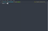

# Terminal Snake Game

A colorful and modern take on the classic **Snake** game, built entirely in **C** for your terminal.  
It features smooth movement, Unicode graphics, and polished win/loss screens.

## Features

- **Arrow-key controls**: simple and responsive gameplay  
- **Dynamic speed**: the snake moves faster as it grows  
- **Unicode graphics**: colorful head, body, and food symbols  
- **Proper terminal handling**: hides cursor, restores settings on exit  
- **Win and loss conditions**: see your final score and snake length  
- **Single-file implementation**: easy to read, compile, and extend  
- **Graceful quit**: press `q` to exit anytime

## Controls

| Key  | Action      |
|------|------------|
| ↑    | Move Up    |
| ↓    | Move Down  |
| ←    | Move Left  |
| →    | Move Right |
| `q`  | Quit game  |

## Gameplay Preview

> *Coming soon — gameplay GIF here!*



## Build & Run

Compile manually:

```bash
gcc snake.c -o snake
./snake
```

Or use the provided Makefile:

```bash
make run
```

## Planned Improvements

- Dynamic grid sizing: automatically adjust the game area based on your terminal size  
- Difficulty levels: add easy, medium, and hard modes that modify:
  - Snake speed  
  - Speed scaling per food  
  - Board size  
- High score tracking: store and display top scores locally  
- Enhanced visuals: optional animations or gradient colors for the snake  
- Simple sound effects (optional): basic terminal sounds for movement and scoring  

## Technical Notes

- Uses the C standard library (`termios`, `unistd`, `select`) for input and timing  
- Restores terminal settings safely on exit  
- Runs on Linux, macOS, and WSL  
- No external dependencies required  

## Requirements

- GCC or Clang  
- UTF-8 compatible terminal (e.g., GNOME Terminal, iTerm2, Alacritty)  

## License

MIT License © 2025 – built for fun and learning
